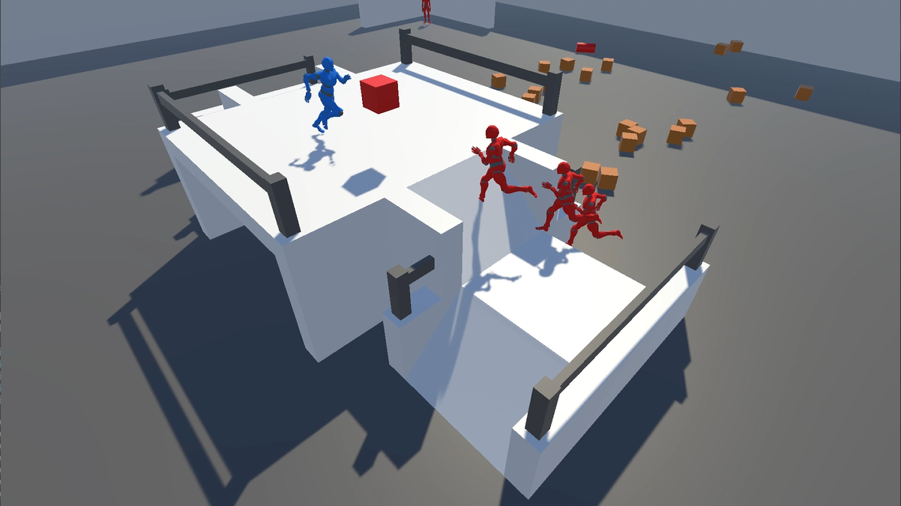
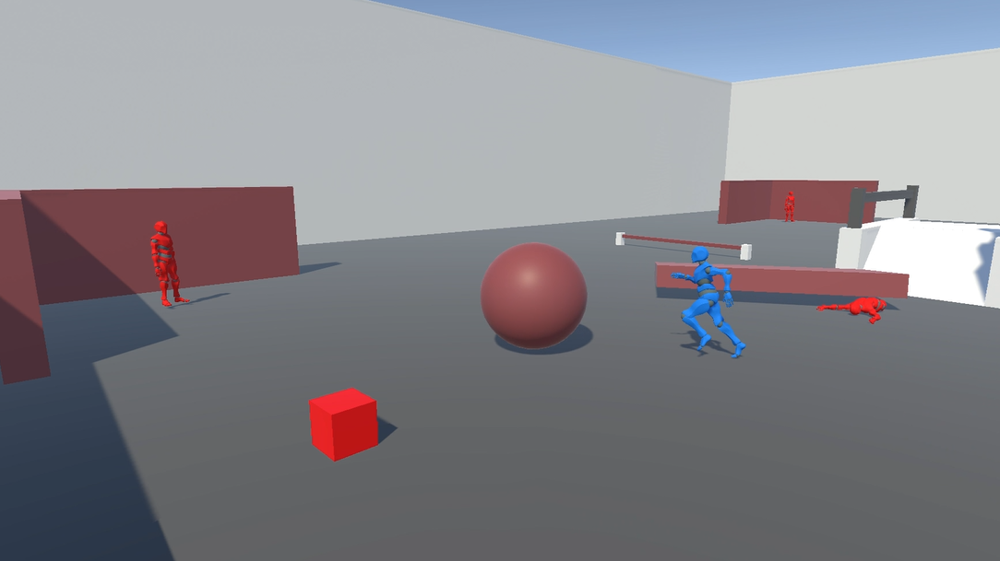
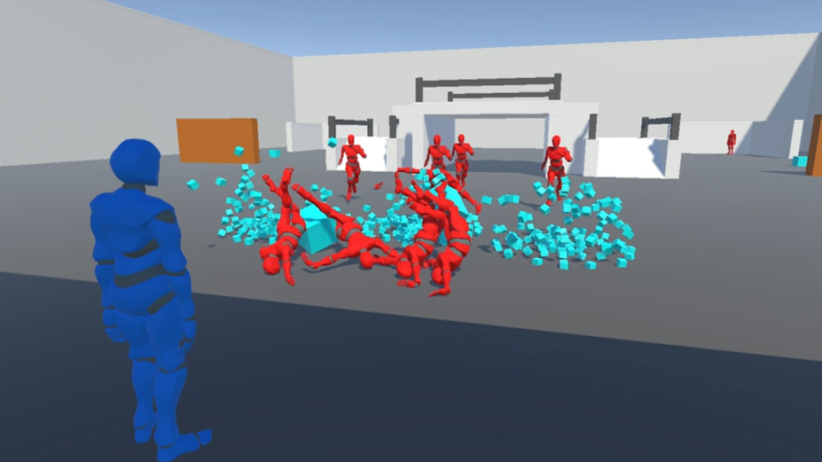

# SpaceLock

Final project for CAP3027 Introduction to Computational Media

**A Mouse is needed to play this game as intended**





### Controls

```
WASD - move
Space - jump
LMB (click & hold) - hold an object
Scroll In - bring an object to you
Scroll Out - throw an object away from you
Escape - pause menu
```

### Rubric Qualifications

- Player Character
    - First-person character controller
    - UI for healthbar & enemy counter
- Interactables
    - Red objects you can pick up and throw
    - Blue pick up objects that explode on impact 
    - Pink hazard objects you can push into enemies
- Enemies
    - Stationary & chasing enemies, with multiple per level
    - Enemies ragdoll on hit and stay down
- Levels
    - 3 unique levels with different items and mechanics
    - Extra demo level for testing
- Interface
    - Main menu and level select screen
    - Pause menu
    - Win and lose screens

### Credits

- Character models and animations from Adobe Mixamo: https://www.mixamo.com/#/
- Gridbox Prototype Materials from Unity Asset Store: https://assetstore.unity.com/packages/2d/textures-materials/gridbox-prototype-materials-129127
